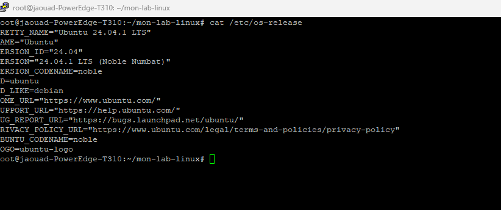
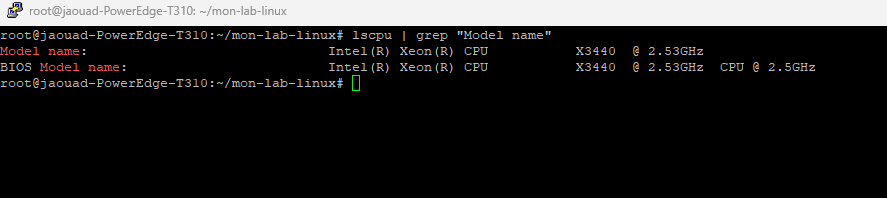
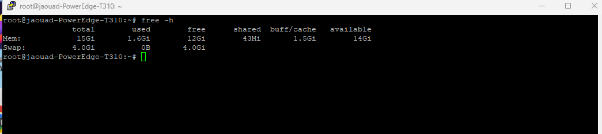
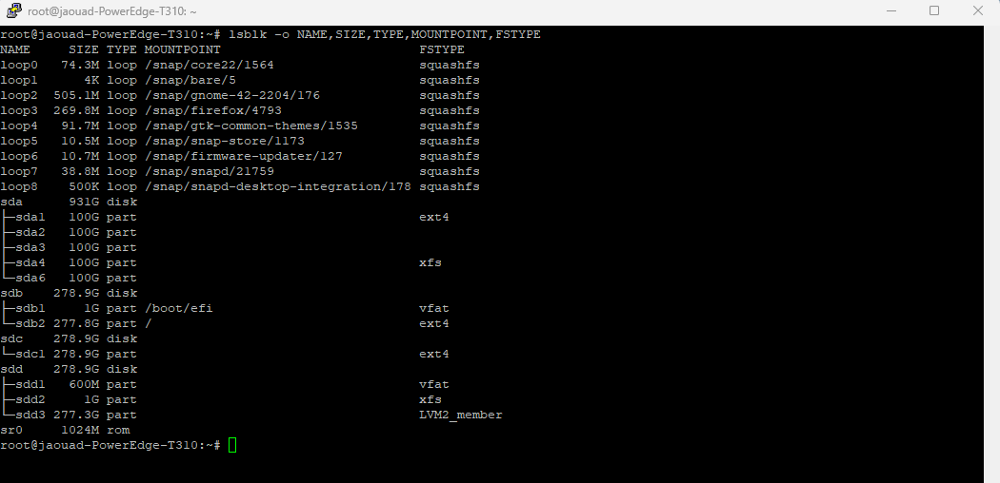
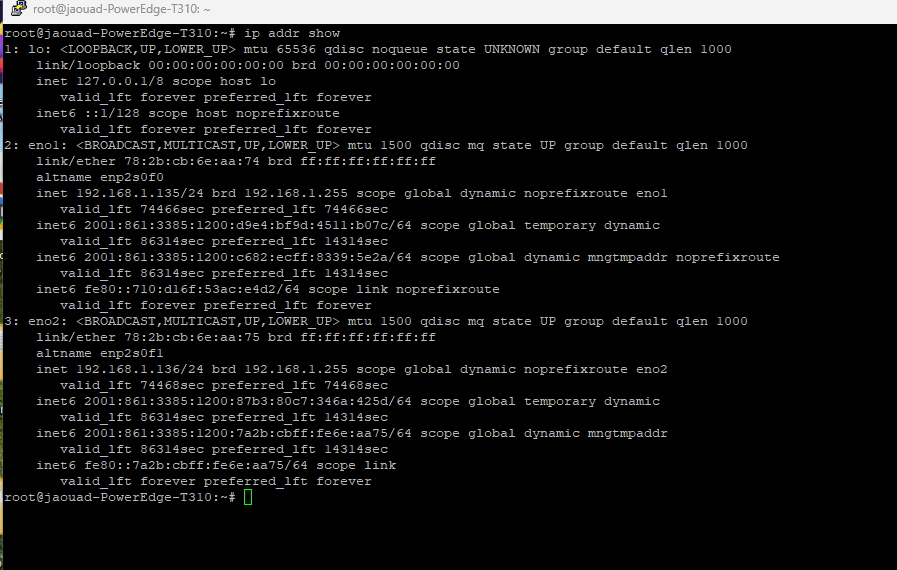
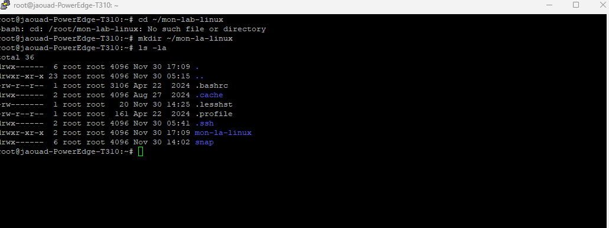

# 🔍 Jour 2 : Mon Premier Audit Système - La Découverte de Ma Machine

> **Date** : 30 Novembre 2025  
> **Humeur du jour** : 🤔 Curieux et parfois perdu  
> **Temps passé** : ~3 heures  
> **Café consommé** : ☕☕☕

---

## 🎬 Le Contexte

Aujourd'hui, j'ai décidé de vraiment **connaître** mon serveur Dell PowerEdge T310. Pas juste savoir qu'il a 16 GB de RAM parce que c'est écrit sur la facture, mais comprendre ce qui tourne dessus, comment il est configuré, et surtout... ce que je ne sais pas encore.

**Ma question du jour** : "Est-ce que je connais vraiment ma propre machine ?"

Spoiler : Non. Pas du tout. Et c'est OK, c'est pour ça que je fais ce projet.

---

## 🧠 Ce Que Je Savais Avant de Commencer

Soyons honnête sur mon niveau de départ :

| Concept | Mon niveau avant | Détails |
|---------|------------------|---------|
| Commandes Linux de base | 🟡 Moyen | `ls`, `cd`, `cat`... les classiques |
| Gestion des disques | 🔴 Faible | Je sais que j'ai des disques, c'est tout |
| Services systemd | 🔴 Faible | J'ai entendu parler de `systemctl`... |
| Réseau Linux | 🔴 Très faible | `ifconfig` ? `ip` ? C'est quoi la diff ? |
| Sécurité serveur | 🔴 Quasi nul | SSH ça marche, mais pourquoi ? |

---

## 🖥️ Découverte #1 : Mon Système d'Exploitation

### Ce que j'ai fait

```bash
cat /etc/os-release
```



### Ce que j'ai découvert

| Information | Valeur |
|-------------|--------|
| **Distribution** | Ubuntu 24.04.1 LTS |
| **Nom de code** | Noble Numbat |
| **Base** | Debian |
| **Hostname** | jaouad-PowerEdge-T310 |

### 💡 Ce que j'ai appris

**LTS ça veut dire quoi ?**  
LTS = Long Term Support. Ubuntu va supporter cette version pendant **5 ans** avec des mises à jour de sécurité. C'est parfait pour un serveur car je n'aurai pas besoin de faire une grosse mise à niveau tous les 6 mois.

**Noble Numbat ?**  
Chaque version d'Ubuntu a un nom de code composé d'un adjectif + un animal, en ordre alphabétique. Après "Noble Numbat" (24.04), il y aura une version en "O" puis en "P", etc.

### 🔴 Ma lacune identifiée
> Je ne comprends pas encore la différence entre les versions "standard" et "LTS" d'Ubuntu, ni quand choisir l'une ou l'autre.

---

## 💻 Découverte #2 : Mon CPU - Un Vrai Processeur Serveur !

### Ce que j'ai fait

```bash
lscpu | grep "Model name"
```



### Ce que j'ai découvert

| Spécification | Valeur |
|---------------|--------|
| **Modèle** | Intel® Xeon® X3440 |
| **Fréquence** | 2.53 GHz (boost à 2.93 GHz) |
| **Architecture** | x86_64 |
| **Génération** | Nehalem (2009) |

### 💡 Ce que j'ai appris

**Le Xeon X3440, c'est quoi exactement ?**

J'ai fait des recherches et j'ai découvert que :
- C'est un CPU **serveur d'entrée de gamme** de 2009
- Il a **4 cœurs physiques** et **8 threads** (Hyper-Threading)
- Il supporte la **RAM ECC** (correction d'erreurs)
- TDP de 95W - il consomme pas mal mais c'est normal pour un serveur

**Pourquoi c'est bien pour mon projet ?**
- Fait pour tourner **24/7** sans surchauffe
- Support de la virtualisation matérielle (VT-x) - important pour mes futures VMs !
- Même si c'est "vieux", c'est largement suffisant pour apprendre

### 🟡 Point de réflexion
> Ce CPU a 15 ans... Il fonctionne toujours parfaitement. Ça montre la robustesse du matériel serveur par rapport aux PC grand public !

### 🔴 Ma lacune identifiée
> Je ne sais pas encore vérifier si toutes les fonctionnalités de virtualisation (VT-x, VT-d) sont activées dans le BIOS.

---

## 🧮 Découverte #3 : La RAM - 15 Go Disponibles !

### Ce que j'ai fait

```bash
free -h
```



### Ce que j'ai découvert

| Métrique | Valeur | Mon analyse |
|----------|--------|-------------|
| **Total** | 15 Gi | Légèrement moins que 16 GB (normal, le système en réserve) |
| **Utilisée** | 1.6 Gi | Ubuntu de base consomme peu ! |
| **Libre** | 12 Gi | Beaucoup de marge |
| **Buff/cache** | 1.5 Gi | Linux utilise la RAM intelligemment |
| **Disponible** | 14 Gi | C'est ce qui compte vraiment |
| **Swap** | 4.0 Gi | Configuré mais non utilisé (0B used) ✅ |

### 💡 Ce que j'ai appris

**Pourquoi "15 Gi" et pas "16 GB" ?**

Deux raisons :
1. **Gi vs GB** : Linux utilise les Gibibytes (1024³) pas les Gigabytes (1000³)
2. Une partie de la RAM est réservée par le système/BIOS

**La magie du buff/cache**

Linux est malin ! Il utilise la RAM "libre" pour accélérer les accès disque (cache). Si une application a besoin de RAM, Linux libère ce cache automatiquement. C'est pour ça que "available" (14 Gi) est le chiffre important, pas "free" (12 Gi).

**Swap à 0B utilisé = bon signe !**

Le swap c'est quand le système utilise le disque dur comme "fausse RAM" car la vraie est pleine. 0B utilisé signifie que j'ai assez de RAM pour l'instant.

### ✅ Victoire du jour
> Avec 14 Gi disponibles, je peux facilement lancer 5-10 VMs légères ou plusieurs conteneurs Docker !

---

## 💾 Découverte #4 : Mes Disques - Configuration Plus Complexe Que Prévu !

C'est là que j'ai passé le plus de temps. Et découvert des surprises...

### Ce que j'ai fait

```bash
lsblk -o NAME,SIZE,TYPE,MOUNTPOINT,FSTYPE
```



### Ma configuration réelle (différente de ce que je pensais !)

```
💿 sda : 931G (Mon plus gros disque - pour les VMs)
   ├── sda1 : 100G → ext4 (pas monté)
   ├── sda2 : 100G → (pas formaté)
   ├── sda3 : 100G → (pas formaté)
   ├── sda4 : 100G → xfs 
   └── sda6 : 100G → (pas formaté)

💿 sdb : 278.9G (Disque système)
   ├── sdb1 : 1G → vfat → /boot/efi (Boot UEFI)
   └── sdb2 : 277.8G → ext4 → / (Racine système)

💿 sdc : 278.9G (Données)
   └── sdc1 : 278.9G → ext4 (pas monté - pour données persistantes)

💿 sdd : 278.9G (Backups + LVM)
   ├── sdd1 : 600M → vfat
   ├── sdd2 : 1G → xfs
   └── sdd3 : 277.3G → LVM2_member 🆕

📀 sr0 : 1024M → Lecteur CD/DVD (rom)
```

### 😲 Surprise du jour : J'ai déjà du LVM !

En regardant `sdd3`, j'ai vu `LVM2_member`. Ça veut dire que j'ai déjà commencé à configurer LVM sans vraiment le savoir (ou je l'ai oublié...). C'est une bonne nouvelle car LVM c'est ce que je voulais apprendre !

### 💡 Ce que j'ai appris

**Pourquoi plusieurs systèmes de fichiers différents ?**

| Système | Où je l'utilise | Pourquoi |
|---------|-----------------|----------|
| **vfat** | /boot/efi | Requis par UEFI, compatible avec tout |
| **ext4** | /, sda1, sdc1 | Le standard Linux, fiable et éprouvé |
| **xfs** | sda4, sdd2 | Performant pour gros fichiers, utilisé par Red Hat |
| **LVM2** | sdd3 | Pas un FS, mais un gestionnaire de volumes logiques |

**Les partitions "snap" c'est quoi ?**

J'ai vu plein de `loop` devices montés sur `/snap/...`. Ce sont les **paquets Snap** d'Ubuntu (Firefox, GNOME, etc.). Chaque snap est une image compressée montée en lecture seule.

### 🔴 Mes lacunes identifiées
> - Je ne comprends pas encore bien comment fonctionne LVM
> - Pourquoi j'ai des partitions non montées sur sda ? À quoi servent-elles ?
> - La différence entre ext4 et xfs en pratique ?

### 📋 TODO pour plus tard
- [ ] Explorer la configuration LVM sur sdd3
- [ ] Décider quoi faire des partitions vides sur sda
- [ ] Monter sdc1 pour les données persistantes

---

## 🌐 Découverte #5 : Le Réseau - Deux Interfaces !

### Ce que j'ai fait

```bash
ip addr show
```



### Ce que j'ai découvert

| Interface | Type | État | Adresse IPv4 | MAC |
|-----------|------|------|--------------|-----|
| **lo** | Loopback | UP | 127.0.0.1/8 | - |
| **eno1** | Ethernet | UP | 192.168.1.135/24 | 78:2b:cb:6e:aa:74 |
| **eno2** | Ethernet | UP | 192.168.1.136/24 | 78:2b:cb:6e:aa:75 |

### 😮 Observation intéressante

Les deux interfaces réseau sont actives et ont des IPs dans le même sous-réseau (192.168.1.x) ! 

- **eno1** = 192.168.1.135 (altname: enp2s0f0)
- **eno2** = 192.168.1.136 (altname: enp2s0f1)

### 💡 Ce que j'ai appris

**Pourquoi "eno1" et pas "eth0" ?**

Depuis systemd, Linux utilise des noms d'interfaces "prédictibles" :
- `en` = Ethernet
- `o` = Onboard (intégré à la carte mère)
- `1` ou `2` = Numéro du port

C'est plus stable car le nom ne change pas si j'ajoute une carte réseau.

**IPv6 aussi !**

J'ai remarqué que j'ai des adresses IPv6 automatiques (commençant par `2001:` et `fe80:`). Je ne les utilise pas pour l'instant mais c'est bon à savoir.

**Deux cartes réseau = possibilités futures**

Avec deux interfaces, je pourrai plus tard configurer :
- **Bonding** : Combiner les 2 pour plus de débit (2 Gbps au lieu de 1)
- **Failover** : Si une carte tombe, l'autre prend le relais
- **Séparation** : Un réseau pour la gestion, un pour les données

### 🔴 Mes lacunes identifiées
> - Je ne sais pas configurer le bonding/teaming
> - Netplan vs NetworkManager vs /etc/network/interfaces - lequel utiliser ?
> - Comment assigner une IP statique sur Ubuntu 24.04 ?

---

## 📁 Découverte #6 : Mon Environnement de Travail

### Structure de mon projet

J'ai commencé à organiser mon projet avec Git :

```bash
ls -la ~
```



### Organisation actuelle

```
/root/
├── .bashrc
├── .profile
├── .ssh/           # Clés SSH (à sécuriser !)
├── .cache/
├── .lesshst
├── mon-la-linux/   # 📂 Mon projet principal !
└── snap/           # Applications Snap
```

### 😅 Erreur de débutant #1

J'ai essayé de faire `cd ~/mon-lab-linux` mais le dossier s'appelait en fait `mon-la-linux` (j'avais oublié le 'b'). J'ai dû créer le bon dossier avec `mkdir ~/mon-la-linux`.


**Leçon apprise** : Toujours vérifier les noms avec `ls` avant de supposer !

### Côté Git (sur mon laptop)


Mon repo GitHub est bien synchronisé avec 4 commits :
1. 🚀 Premier commit - Début de mon voyage Linux
2. 📦 Ajout du contenu complet du projet (x3)

J'ai un fichier `setup-projet.sh` non tracké - à ajouter !

---

## 🔧 Découverte #7 : Mes Premières Erreurs (et comment j'ai appris)

### Erreur #1 : Script introuvable

```bash
cat ~/mon-lab-linux/scripts/audit-simple.sh
# Erreur : No such file or directory
```


**Problème** : J'ai essayé d'exécuter un script qui n'existait pas encore !

**Leçon** : Toujours vérifier l'existence d'un fichier avant de l'utiliser :
```bash
ls -la ~/mon-lab-linux/scripts/  # Vérifier d'abord
```

### Erreur #2 : Dossier de backup inexistant

```bash
ls -lh ~/mon-lab-linux/configs/backup-initial/
# Erreur : cannot access - No such file or directory
```


**Solution** : Créer le dossier avec l'option `-p` (crée les parents si nécessaire)
```bash
mkdir -p ~/mon-lab-linux/configs/backup-initial/
```

### 💡 Ce que j'ai appris de mes erreurs

1. **Vérifier avant d'agir** : `ls` est ton ami
2. **`mkdir -p`** : Crée toute l'arborescence d'un coup
3. **Les erreurs sont normales** : Même les pros en font !

---

## 📊 Résumé : Mon État des Lieux Complet

### ✅ Ce qui va bien

- [x] Ubuntu 24.04.1 LTS installé et fonctionnel
- [x] CPU Xeon robuste, fait pour tourner 24/7
- [x] 14 Gi de RAM disponible - largement suffisant
- [x] Stockage total : ~1.7 TB sur 4 disques
- [x] Deux interfaces réseau fonctionnelles
- [x] Git configuré et repo GitHub créé
- [x] LVM déjà partiellement configuré sur sdd3

### ⚠️ Ce qui nécessite du travail

| Priorité | Problème | Impact | Quand le traiter |
|----------|----------|--------|------------------|
| 🔴 Critique | Sécurité SSH non vérifiée | Risque d'intrusion | Jour 3 |
| 🔴 Critique | Firewall non vérifié | Exposition réseau | Jour 3 |
| 🟡 Important | Partitions non montées (sda, sdc) | Espace inutilisé | Jour 4-5 |
| 🟡 Important | Backups non configurés | Risque perte données | Jour 6-7 |
| 🟢 À faire | Bonding réseau | Performance/redondance | Jour 8+ |
| 🟢 À faire | Explorer LVM sur sdd3 | Comprendre ma config | Jour 4 |

### 🔴 Mes Plus Grandes Lacunes (honnêtement)

1. **LVM** - J'ai du LVM configuré mais je ne sais pas comment l'utiliser
2. **Le réseau avancé** - Bonding, VLANs, IP statique...
3. **La sécurité** - SSH, firewall, utilisateurs...
4. **Systèmes de fichiers** - Quand utiliser ext4 vs xfs vs btrfs ?

---

## 📈 Ma Progression

### Compétences avant/après Jour 2

| Compétence | Avant | Après | Progression |
|------------|-------|-------|-------------|
| Commandes système | 🟡 | 🟢 | +1 |
| Compréhension hardware | 🔴 | 🟡 | +1 |
| Gestion des disques | 🔴 | 🟡 | +1 |
| Réseau | 🔴 | 🔴 | = (besoin de pratique) |
| Git/GitHub | 🟡 | 🟢 | +1 |

### Nouvelles commandes maîtrisées

```bash
# Système
cat /etc/os-release   # Infos distribution
lscpu | grep "Model"  # Infos CPU
free -h               # RAM en format lisible

# Disques
lsblk -o NAME,SIZE,TYPE,MOUNTPOINT,FSTYPE  # Vue complète

# Réseau
ip addr show          # Interfaces réseau (remplace ifconfig)

# Fichiers
ls -la                # Liste détaillée avec fichiers cachés
mkdir -p              # Créer dossiers récursivement
```

---

## 🤔 Réflexions Personnelles

### Ce que j'ai ressenti aujourd'hui

> "J'ai commencé en pensant que je connaissais mon serveur. En fait, je ne connaissais que la surface. Chaque commande m'a révélé quelque chose de nouveau."

> "Le moment où j'ai découvert que j'avais déjà du LVM configuré sur sdd3... soit je l'ai fait et oublié, soit c'était là à l'installation. Dans les deux cas, ça montre que je dois mieux documenter ce que je fais !"

> "Les erreurs de chemin de fichier (mon-lab-linux vs mon-la-linux) sont frustrantes mais c'est comme ça qu'on apprend à être rigoureux."

### Questions que je me pose encore

- [ ] Comment les "vrais" admins sys font-ils un audit ? Y a-t-il des outils automatiques ?
- [ ] Est-ce que je devrais installer un outil de monitoring dès maintenant ?
- [ ] Que faire de toutes ces partitions non montées sur sda ?

---

## 📚 Ressources Qui M'ont Aidé

- [Ubuntu 24.04 Release Notes](https://wiki.ubuntu.com/NobleNumbat/ReleaseNotes)
- [Linux Journey](https://linuxjourney.com/) - Pour les bases
- [Explainshell](https://explainshell.com/) - Pour comprendre les commandes

---

## 🎯 Plan Pour Demain (Jour 3)

**Objectif principal** : Vérifier et sécuriser SSH + Firewall

- [ ] Vérifier la configuration SSH actuelle
- [ ] Configurer l'authentification par clé SSH
- [ ] Vérifier l'état du firewall (UFW)
- [ ] Configurer les règles de base du firewall
- [ ] Installer et configurer Fail2ban

---

## 📈 Progression Globale

```
Jour 2/365 complété ✅

[██░░░░░░░░░░░░░░░░░░] 0.5%

Connaissances acquises : +500% par rapport à hier ! 📈
```

---

**Ce que je retiens de ce Jour 2 :**  
> "Auditer son système, c'est surtout auditer ses propres connaissances. Et découvrir tout ce qu'on ne sait pas encore... c'est excitant !"

---

**⬅️ [Jour 1 : Introduction](../jour-01/README.md)** | **[Jour 3 : Sécurisation SSH](../jour-03/README.md) ➡️**
